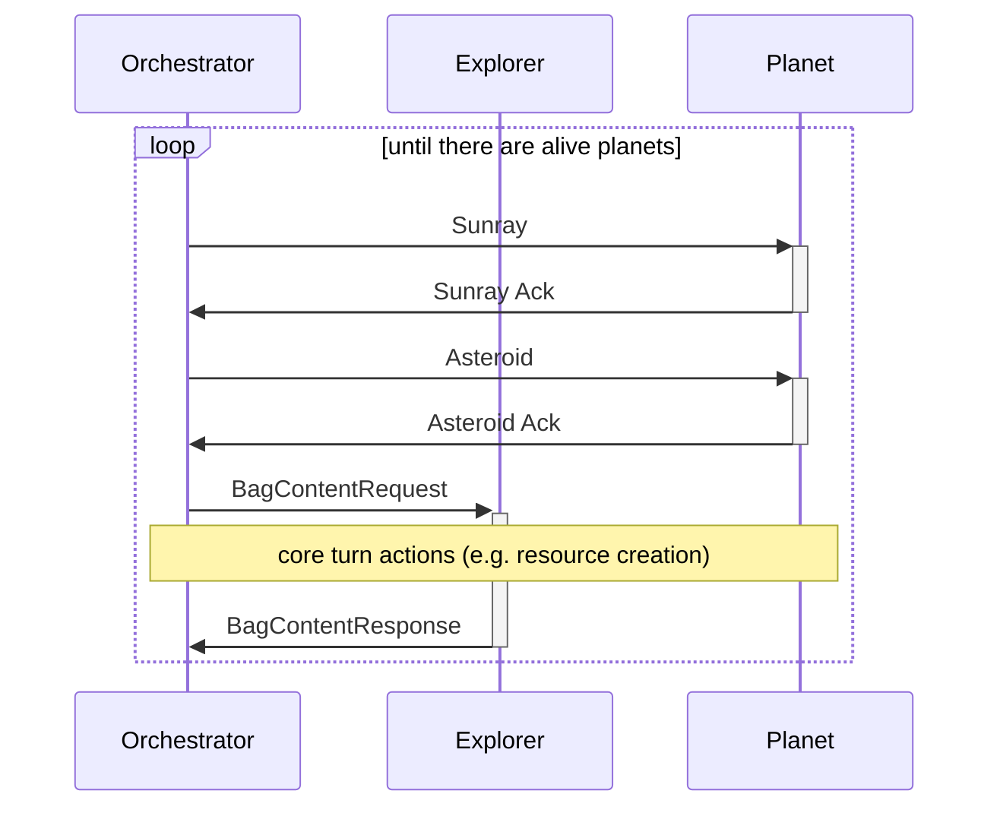

# Rusty Crab advanced programming project

> [!WARNING]
> OneMillionCrabs sometimes causes issues and
> crashes (the bug is reported), if it happens (stack overflow)
> comment line 31 [here](./src/orchestrator/init/galaxy_builder.rs)
> and adjust the array size

## Run
Use `cargo run` to execute the project. Inspect the available options
with `cargu run -- -help`. You can supply a config file with
`cargo run -- -c config.toml`, the default one is 
available [here](./default_config.toml).

## Environment setup
You can use [nix](https://nixos.org/explore/) to setup a developement environment, better with direnv.
Just run `nix develop` to enter a shell with all the requirements available, or `nix build` to build
the project without need to install anything else and pollute your sustem.
If rust-rover doesn't find the std just run `echo $RUST_SRC_PATH` and use this path when it asks to attach the
std manually.

## Internal design

This orchestrator uses a turn-based design, here a sequence diagram
of the phases in a single turn:

> [!NOTE]
> Planets are passive entities, they cannot initiate interactions

The galaxy decays over time (the asteroid probability tends to 1). So
soon or later there will be no more alive planets and the orchestrator will stop.
